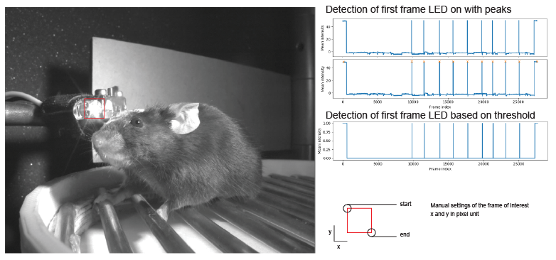

# ledDetect
utils to detect signal coming from LED on video based on mean change of pixel intensity on local area

# graphical example illustrating LEDdetect

# things to implement
## for extracting mean intensity
* implement the options to work on n areas  

## for signal extraction
* implement 3 potentional alternative for extraction events from mean intensity in the time series
- using threshold (similar to DLC likelihood strategy)
- using find_peaks (list prefered)
- if the signal is not good other signal processing can be implement